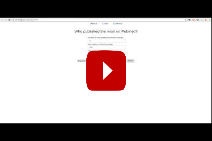

# Projects

## 1. Web programming - data scraping, pipelining, visualisation

### 1.1. [Pubmed's top authors](https://github.com/gknam/pubmed-top-authors)

#### Description

User submits an author name or a keyword with other parameters (number of articles, number of authors to plot, date range from the day of search). Pubmed database is queried, and returned data is drawn as interactive plots.

#### Languages, packages and framework used
* Backend
   * Python (Flask)
   * SQLite3 (via Python's SQLALchemy)
* Frontend
   * HTML
   * CSS
   * JavaScript (D3.js, jQuery, jQueryUI, Bootstrap, typeahead, handlebars)

#### Technical notes

* Backend
    * Auto-update database at regular interval (not fully tested)
        * Scrape using Pubmed's API
        * Extract info from XML and save it into SQLite3 database (should be replaced by PostgreSQL)
    * Upon receipt of search request from frontend, query either SQLite3 database or [Pubmed API](https://www.ncbi.nlm.nih.gov/books/NBK25501/).
    * Send data to frontend
* Frontend
    * Rearrange data
    * Draw interactive plots using D3.js

## 2. Data science projects

###  2.1. Guided projects at DataQuest

* Step 1: Python Introduction
    * Python Programming: Beginner
        * [Using Jupyter notebook](https://github.com/gknam/dataquest_projects/blob/master/DataScientist/Step1_PythonIntro/1_PythonBeginner/project1/UsingJupyterNotebook.ipynb)
        * [Explore U.S. Births](https://github.com/gknam/dataquest_projects/blob/master/DataScientist/Step1_PythonIntro/1_PythonBeginner/project2/ExploreUsBirths.ipynb)
    * Python Programming: Intermediate
        * [Exploring Gun Deaths in the US](https://github.com/gknam/dataquest_projects/blob/master/DataScientist/Step1_PythonIntro/2_PythonIntermediate/project1/ExploringGunDeathsInTheUS.ipynb)
* Step 2: Data Analysis and Visualization
    * Data Analysis with Pandas: Intermediate
        * [Analyzing Thanksgiving Dinner](https://github.com/gknam/dataquest_projects/blob/master/DataScientist/Step2_DataAnalVis/1_pandas/project1/AnalyzingThanksgivingDinner.ipynb)
    * Exploratory Data Visualization
        * [Visualizing Earnings Based On College Majors](https://github.com/gknam/dataquest_projects/blob/master/DataScientist/Step2_DataAnalVis/2_dataAnalVis/project1/Visualizing_Earnings_Based_On_College_Majors.ipynb)
    * Storytelling Through Data Visualization
        * [Visualizing The Gender Gap In College Degrees](https://github.com/gknam/dataquest_projects/blob/master/DataScientist/Step2_DataAnalVis/3_StorytellingThroughDataVisualization/project1/VisualizingTheGenderGapInCollegeDegrees.ipynb)
    * Data Cleaning
        * [Analyzing NYC High School Data](https://github.com/gknam/dataquest_projects/blob/master/DataScientist/Step2_DataAnalVis/4_DataCleaning/project1/AnalyzingNYCHighSchoolData.ipynb)
        * [Star Wars Survey](https://github.com/gknam/dataquest_projects/blob/master/DataScientist/Step2_DataAnalVis/4_DataCleaning/project2/StarWarsSurvey.ipynb)
* Step 3: The Command Line
    * Command Line: Beginner
        * [Working With Data Downloads](https://github.com/gknam/dataquest_projects/blob/master/DataScientist/Step3_TheCommandLine/1_CommandLine-Beginner/project1/WorkingWithDataDownloads.ipynb)
    * Command Line: Intermediate
        * [Transforming data with Python](https://github.com/gknam/dataquest_projects/blob/master/DataScientist/Step3_TheCommandLine/2_CommandLine-Intermediate/project1/TransformingDataWithPython.ipynb)
* Step 4: Working with Data Sources
    * SQL Fundamentals
        * [Analyzing CIA Factbook Data Using SQLite and Python](https://github.com/gknam/dataquest_projects/blob/master/DataScientist/Step4_WorkingWithDataSources/2_SQLfundamentals/project1/AnalyzingCIAfactbookDataUsingSQLiteAndPython.ipynb)
    * SQL and Databases: Intermediate (old)
        * [Preparing data for SQLite](https://github.com/gknam/dataquest_projects/blob/master/DataScientist/Step4_WorkingWithDataSources/3_SQLAndDatabases-Intermediate/project1/PreparingDataForSQLite.ipynb)
        * [Creating relations in SQLite](https://github.com/gknam/dataquest_projects/blob/master/DataScientist/Step4_WorkingWithDataSources/3_SQLAndDatabases-Intermediate/project2/CreatingRelationsInSQLite.ipynb)
    * SQL and Databases: Intermediate (new)
        * [Answering Business Questions using SQL](https://github.com/gknam/dataquest_projects/blob/master/DataScientist/Step4_WorkingWithDataSources/2_SQLIntermediate-TableRelationsAndJoins/project1/AnsweringBusinessQuestionsUsingSQL.ipynb)
        * [Designing and Creating a Database](https://github.com/gknam/dataquest_projects/blob/master/DataScientist/Step4_WorkingWithDataSources/2_SQLIntermediate-TableRelationsAndJoins/project2/DesigningAndCreatingDatabase.ipynb)
* Step 5: Probability and Statistics
    * Probability and Statistics in Python: Beginner
        * [Analyzing Movie Reviews](https://github.com/gknam/dataquest_projects/blob/master/DataScientist/Step5_ProbabilityAndStatistics/1_ProbabilityAndStatisticsInPython-Beginner/project1/AnalyzingMovieReviews.ipynb)
    * Probability and Statistics in Python: Intermediate
    	* [Winning Jeopardy](https://github.com/gknam/dataquest_projects/blob/master/DataScientist/Step5_ProbabilityAndStatistics/2_ProbabilityAndStatisticsInPython-Intermediate/project1/WinningJeopardy.ipynb)
* Step 6: Machine Learning
    * Machine Learning Fundamentals
        * [Predicting Car Prices](https://github.com/gknam/dataquest_projects/blob/master/DataScientist/Step6_MachineLearning/1_MachineLearningFundamentals/project1/PredictingCarPrices.ipynb)
    * Linear Regression For Machine Learning
        * [Predicting House Sale Prices](https://github.com/gknam/dataquest_projects/blob/master/DataScientist/Step6_MachineLearning/4_LinearRegressionForMachineLearning/project1/PredictingHouseSalePrices.ipynb)